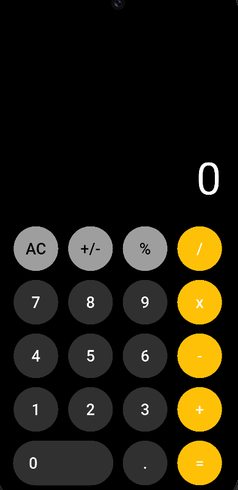

🧮 Calculator App

    A modern, highly responsive, and feature-rich calculator application built using Flutter and Dart. This project is designed to showcase clean UI/UX implementation, state management. 

📑 Table of Contents

    ✨ Features
    
    🧠 Core Logic and Architecture (MVC)
    
    📸 Screenshots & Demo Gallery
    
    🛠️ Technologies Used
    
    🚀 Getting Started
    
    📜 License

✨ Features

    This calculator goes beyond basic arithmetic, offering a clean, intuitive interface and essential engineering functionalities:
    
    Dark Mode Focused UI: Features a sleek, minimalist dark theme with high-contrast, yellow-gold accents for operators, ensuring excellent legibility and a premium feel.
    
    Responsive UI/UX: The layout dynamically adjusts to different screen sizes (mobile, tablet, and web), maintaining aesthetic appeal and usability.
    
    Clean Architecture: Implements a View-Controller Pattern using three distinct layers (View, Controller, Model) for maximum separation of concerns.

🧠 Core Logic and Architecture

    The application is structured using a clean separation of concerns to promote maintainability and testability:
    
    main.dart: The application entry point.
    
    lib/controller/calculator_controller.dart: The Controller acts as the crucial intermediary, translating button presses from the View into specific instructions for the Model. This completely decouples the UI from the business logic.
    
    lib/view/calculator_view.dart: The View (presentation layer) handles the UI layout, captures user interaction, and manages the displayed output using local state (setState()).
    
    CalculatorModel: The Model is the pure data and calculation logic class, holding the state (num1, num2, operand) and performing the arithmetic.

🛠️ Technologies Used

    Framework: Flutter 
    
    Language: Dart 

🚀 Getting Started
    
    Follow these steps to set up the project locally on your machine.
    
    Prerequisites
    You need the following installed:
    
    Flutter SDK
    
    Dart SDK
    
    A code editor (VS Code or Android Studio) with Flutter/Dart plugins installed.
    
    Installation
    Clone the repository:
    
    git clone [[https://github.com/YourUsername/flutter_calculator.git](https://github.com/YourUsername/flutter_calculator.git](https://github.com/ShadabXaifi/calculator-app.git))
    cd flutter_calculator
    
    
    
    Fetch dependencies:
    
    flutter pub get
    
    
    
    Run the application:
    
    flutter run
    
    

(Ensure you have an emulator, physical device, or desktop target selected.)
